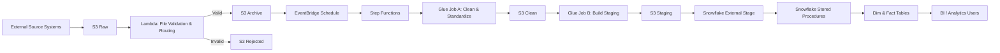
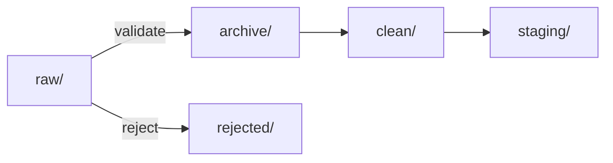
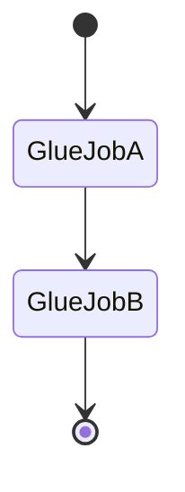
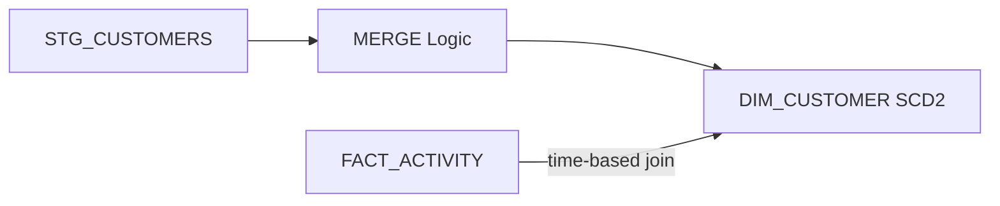
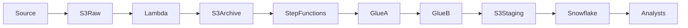

# Telco Customer - Orchestrated Data Pipeline

## Enterprise-Grade Batch Data Engineering Project (AWS + Snowflake)

---

## Overview

**Telco Customer 360** is a production, end-to-end **batch data pipeline** designed to consolidate customer, subscription, and activity data into an analytics-ready **Customer 360 warehouse**.

The project simulates **Data Engineering** concept of building and operating data pipelines in a medium-to-large telecom organization covering ingestion, validation, orchestration, transformation, historical tracking (SCD Type 2), and warehouse automation.

The final output supports **business analysts and BI tools** with clean, reliable, and historically accurate data.

- **⚙️ Domain:** Data Engineering | Analytics Engineering
- **🧱 Stack:** AWS • Glue • Step Functions • Snowflake • S3

---

## Business Problem

Telecom companies typically store customer information across multiple systems:

- CRM systems (customer demographics)
- Billing systems (subscription plans)
- Network systems (usage and activity logs)

These systems:
- Use **different data formats**
- Update at **different frequencies**
- Do **not preserve history**

This makes it difficult to answer questions like:
- What plan was a customer on when an activity occurred?
- How has customer behavior changed over time?
- Which plans drive the most usage or churn?

This project solves that by building a **Customer 360 warehouse** with full historical tracking.

---

## High-Level Architecture



---

## 📂 Data Sources

| Dataset | Description | Format |
|------|------------|--------|
| Customers | Demographics & subscription mapping | NDJSON |
| Plans | Subscription plan definitions | CSV |
| Activity Logs | Network usage events | NDJSON |

**Why multiple formats?**  
Real-world pipelines must ingest heterogeneous data from different systems.

---

## 🪣 S3 Data Lake Design

### Bucket
```
s3://telco-customer360-pipeline/
```

### Folder Structure
```
raw/        → Untrusted landing zone
archive/    → Validated, immutable source data
rejected/   → Invalid or corrupt files (alerted)
clean/      → Standardized, schema-enforced data
staging/    → Analytics-ready snapshots
```

### Dataset Namespaces
```
customers/
plans/
activity_logs/
```

### S3 Lifecycle Flow


**Design principles**
- Clear data lifecycle
- Safe reprocessing & backfills
- Separation of ingestion vs analytics
- Auditability

---

## 🔐 Security & IAM Model

**Principle:** Least Privilege

| Role | Service | Purpose |
|----|-------|--------|
| Lambda Ingestion Role | Lambda | File validation & routing |
| Glue Job Role | AWS Glue | ETL processing |
| Step Functions Role | Step Functions | Orchestration |
| Snowflake IAM Role | Snowflake | Secure S3 access |

**Key Security Practices**
- No shared roles across services
- Explicit trust relationships
- Snowflake assumes AWS IAM role (no credentials stored)

---

## ⚙️ Orchestration & Scheduling

### EventBridge
- Time-based batch schedule (e. daily)
- Triggers Step Functions
- Decoupled from file arrival

### Step Functions State Machine


**Why Step Functions?**
- Explicit job sequencing
- Failure visibility
- Retry & monitoring support
- Enterprise-grade orchestration

---

## Glue Job A - Clean & Standardize

**Purpose**
- Convert heterogeneous formats into consistent Parquet
- Enforce schema and data types
- Separate good vs bad records

**Input**
```
archive/
```

**Output**
```
clean/
```

**Responsibilities**
- Schema enforcement
- Type casting
- Basic validation

**Intentionally does NOT**
- Deduplicate
- Join datasets
- Build analytics logic

---

## Glue Job B - Build Staging Snapshots

**Purpose**
Prepare analytics-ready data.

**Input**
```
clean/
```

**Output**
```
staging/
```

**Responsibilities**
- Deduplicate records
- Join customers ↔ plans
- Produce point-in-time activity data

---

## ❄️ Snowflake Warehouse Design

### Database
```
TELCO_DB
```

### Schemas
- STAGING — transient load tables
- DW — analytics layer

### Tables

**STAGING**
- STG_CUSTOMERS
- STG_PLANS
- STG_ACTIVITY

**DIMENSIONS**
- DIM_PLAN (Type 1)
- DIM_CUSTOMER (SCD Type 2)

**FACT**
- FACT_ACTIVITY (append-only, historical)

---

## 🕰️ SCD Type 2 - Customer History

**Tracked changes**
- Plan changes
- Status changes
- Contact updates

**How it works**
- Old record closed with `effective_end_date`
- New record inserted
- `is_current` flag maintained
- Fact table joins by event timestamp



✔ Full history preserved  
✔ Past analytics never change  

---

## 🔁 Snowflake Automation

### Stored Procedures
- Load staging
- Load dimensions
- Load facts

### Master Procedure
```
SP_RUN_CUSTOMER360_PIPELINE
```

### Snowflake TASK
- Scheduled execution
- Runs entire warehouse load
- Decoupled from AWS pipeline
- Safe even if upstream data is late

---

## 📊 Downstream Consumers

**Who uses the data**
- Business analysts
- BI tools (Power BI, Tableau)
- Reporting & dashboards

**What they get**
- Clean dimensions
- Historical facts
- Correct customer-plan attribution
- Analytics-ready tables

---

## 🧠 Key Engineering Decisions

- Batch architecture over streaming (cost & simplicity)
- Step Functions for orchestration
- Snowflake TASK for warehouse automation
- SCD Type 2 for customer history
- No Lambda Snowflake connector (simpler & safer)

---

## 🏁 End-to-End Flow Summary


---

# 📫 Contact

## Oluwatosin Amosu Bolaji 
- Data Engineer 
- Buiness Intelligence Analyst
- ETL Developer

#### 🚀 **Always learning. Always building. Data-driven to the core.**  

### 📫 **Let’s connect!**  
- 📩 oluwabolaji60@gmail.com
- 🔗 : [LinkedIn](https://www.linkedin.com/in/oluwatosin-amosu-722b88141)
- 🌐 : [My Portfolio](https://www.datascienceportfol.io/oluwabolaji60) 
- 𝕏 : [Twitter/X](https://x.com/thee_oluwatosin?s=21&t=EqoeQVdQd038wlSUzAtQzw)
- 🔗 : [Medium](https://medium.com/@oluwabolaji60)
- 🔗 : [View my Repositories](https://github.com/Tbrown1998?tab=repositories)