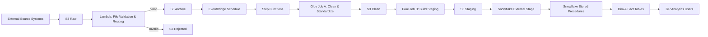
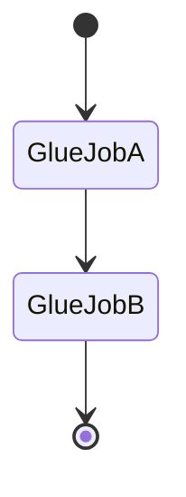
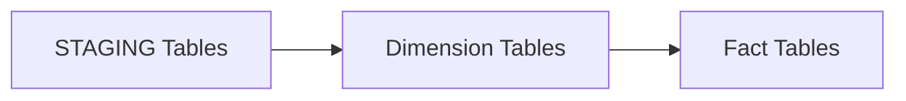

# Architecture Overview  
## Telco Customer 360 Orchestrated Data Pipeline

---

## 1. Architecture Objective

The objective of this architecture is to design a **scalable, secure, and maintainable batch data pipeline** that ingests heterogeneous telecom data, enforces data quality, preserves historical changes, and delivers analytics-ready datasets to a cloud data warehouse.

The architecture reflects **real-world enterprise patterns**, separating:
- ingestion
- validation
- transformation
- orchestration
- warehousing
- analytics consumption

---

## 2. Architectural Principles

The design is guided by the following principles:

### Separation of Concerns
Each layer of the pipeline has a **single responsibility**, reducing coupling and simplifying maintenance.

### Batch-Oriented Reliability
The pipeline favors **deterministic batch processing** over streaming to ensure:
- reproducibility
- safe reprocessing
- simpler failure recovery

### Data Immutability
Once validated, source data is **never modified**, only appended and versioned.

### Least-Privilege Security
Every AWS and Snowflake component operates under a **dedicated role** with minimal permissions.

### Warehouse-Centric Analytics
Business logic and historical tracking are implemented **inside the warehouse**, close to the data consumers.

---

## 3. High-Level System Components

### AWS Services
- Amazon S3 (data lake)
- AWS Lambda (file validation & routing)
- AWS Glue (ETL processing)
- AWS Step Functions (orchestration)
- Amazon EventBridge (scheduling)
- Amazon SNS (alerting)

### Data Warehouse
- Snowflake (storage, transformations, analytics)

---

## 4. End-to-End Architecture Flow

```mermaid
flowchart LR
    SRC[External Source Systems] --> RAW[S3 Raw Zone]
    RAW --> LAMBDA[Lambda Validation & Routing]
    LAMBDA -->|Valid| ARCHIVE[S3 Archive Zone]
    LAMBDA -->|Invalid| REJECTED[S3 Rejected Zone]
    ARCHIVE --> SCHED[EventBridge Schedule]
    SCHED --> SF[Step Functions]
    SF --> G1[Glue Job A Clean & Standardize]
    G1 --> CLEAN[S3 Clean Zone]
    CLEAN --> G2[Glue Job B Build Staging]
    G2 --> STAGING[S3 Staging Zone]
    STAGING --> SFK[Snowflake External Stage]
    SFK --> DW[Snowflake Warehouse DIM & FACT Tables]
    DW --> USERS[Analysts / BI Tools]
```

---

## 5. S3-Centric Data Lake Architecture

Amazon S3 acts as the system of record for all raw and processed data.

### Data Zones

| Zone | Purpose |
|----|--------|
| Raw | Initial landing zone for all incoming files |
| Archive | Validated, immutable source of truth |
| Rejected | Invalid or corrupt files |
| Clean | Schema-enforced, standardized data |
| Staging | Analytics-ready snapshots |

### Why Multiple Zones?
- Enables safe reprocessing
- Prevents bad data from contaminating downstream systems
- Provides auditability and lineage

---

## 6. Orchestration Architecture

### Event-Based Scheduling
- EventBridge triggers the pipeline on a fixed schedule
- Decouples execution from file arrival timing

### Workflow Control
AWS Step Functions orchestrates Glue jobs sequentially, ensuring:
- correct execution order
- clear failure points
- centralized execution history

---

## 7. ETL Processing Architecture

### Glue Job A — Data Standardization
- Converts heterogeneous formats (NDJSON, CSV)
- Enforces schemas
- Produces clean Parquet outputs

### Glue Job B — Analytics Preparation
- Deduplicates records
- Resolves latest entity states
- Prepares analytics-ready datasets

This two-job design improves debuggability and operational clarity.

---

## 8. Snowflake Warehouse Architecture

### Logical Layers

### Dimensional Modeling
- DIM_CUSTOMER — SCD Type 2
- DIM_PLAN — Type 1
- FACT_ACTIVITY — full historical preservation

### Warehouse Automation
Snowflake stored procedures encapsulate transformations, while a Snowflake TASK schedules execution independently of AWS.

---

## 9. Security Architecture

### AWS Security
- Dedicated IAM roles per service
- Explicit trust relationships
- No shared credentials

### Snowflake Security
- IAM-based storage integration
- Role-based access control
- No secrets stored in AWS for Snowflake access

---

## 10. Downstream Consumption Architecture

Final warehouse tables are optimized for:
- BI dashboards
- Trend analysis
- Customer lifecycle analysis
- Plan performance reporting

Analysts interact only with the DW schema and are abstracted from pipeline complexity.

---

## 11. Architectural Trade-Offs

| Decision | Rationale |
|-------|----------|
| Batch over streaming | Lower cost, simpler recovery |
| Step Functions | Explicit orchestration & visibility |
| Snowflake TASK | Eliminates Lambda Snowflake connector |
| SCD Type 2 | Accurate historical analytics |

---

## 12. Architecture Summary

This architecture delivers:
- Clear data ownership per layer
- Strong operational reliability
- Historical accuracy
- Enterprise-grade security
- Maintainability and extensibility

It closely mirrors real-world Customer 360 architectures used in telecom, fintech, and SaaS organizations.
