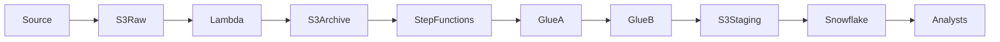

# Data Flow  
## Telco Customer 360 Orchestrated Data Pipeline

---

## 1. Purpose of This Document



This document describes **how data moves through the system**, from ingestion to analytics consumption, including:
- data states
- transformations
- validations
- handoffs between services

The focus is on **flow and responsibility**, not implementation detail.

---

## 2. Source-to-Warehouse Data Flow

At a high level, data flows through the following stages:

```
External Sources
→ S3 Raw
→ Lambda Validation
→ S3 Archive
→ Glue Job A
→ S3 Clean
→ Glue Job B
→ S3 Staging
→ Snowflake Warehouse
→ Analysts
```

Each step enforces a **clear contract** before data is allowed to proceed.

---

## 3. Ingestion Flow (Raw → Archive / Rejected)

### Entry Point
Data enters the platform via file uploads into:

```
s3://telco-customer360-pipeline/raw/
```

### Lambda Validation Responsibilities
- Identify dataset type (customers, plans, activity)
- Validate file format (NDJSON / CSV)
- Reject corrupt or malformed files
- Prevent schema-breaking data from entering ETL

### Outcomes
- **Valid files**
```
raw/ → archive/
```

- **Invalid files**
```
raw/ → rejected/
```

Rejected files trigger notifications and never reach downstream systems.

---

## 4. Standardization Flow (Archive → Clean)

### Glue Job A — Clean & Standardize

**Input**
```
archive/
```

**Processing**
- Parse heterogeneous formats
- Enforce schema
- Cast data types
- Normalize column naming
- Separate good and bad records

**Output**
```
clean/
```

This stage ensures **structural consistency**, but does not apply business logic.

---

## 5. Analytics Preparation Flow (Clean → Staging)

### Glue Job B — Build Staging Snapshots

**Input**
```
clean/
```

**Processing**
- Deduplicate records
- Resolve latest entity state
- Join customer ↔ plan data
- Prepare point-in-time activity facts

**Output**
```
staging/
```

The `staging` layer represents the **formal contract** with the data warehouse.

---

## 6. Warehouse Load Flow (Staging → Snowflake)

### External Stage
Snowflake reads data directly from S3 using a secure IAM-based storage integration.

### Load Pattern
1. COPY data into STAGING tables
2. Transform into dimensions and facts
3. Preserve historical accuracy

This approach avoids unnecessary data movement and credential sharing.

---

## 7. Dimensional Data Flow

### Dimension Tables
- `DIM_PLAN` (Type 1 overwrite)
- `DIM_CUSTOMER` (SCD Type 2)

### Fact Table
- `FACT_ACTIVITY` (append-only)

Facts are linked to the **correct historical customer record** using event timestamps.

---

## 8. Downstream Consumption Flow

Once loaded, data is consumed exclusively from:

```
TELCO_DB.DW
```

Consumers include:
- Business analysts
- BI tools
- Reporting systems

All pipeline complexity is abstracted away from end users.

---

## 9. Data Flow Guarantees

This architecture guarantees:
- No corrupt data reaches analytics
- Historical accuracy is preserved
- Reprocessing is safe and deterministic
- Each layer has a single responsibility

---

## 10. Summary

The data flow is designed to be:
- predictable
- auditable
- recoverable
- enterprise-ready

Each transition enforces data quality before allowing progression to the next stage.
