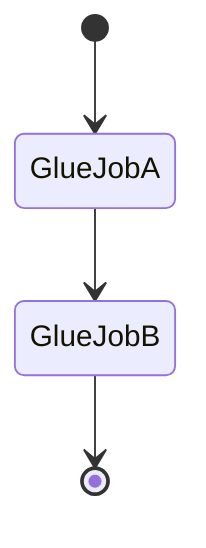

# Orchestration  
## Telco Customer 360 Orchestrated Data Pipeline

---

## 1. Orchestration Goals

The orchestration layer ensures that:
- pipeline steps run in the correct order
- failures are visible and traceable
- execution is deterministic
- scheduling is centralized

---

## 2. Scheduling Strategy

### EventBridge
- Time-based batch scheduling
- Decoupled from file arrival
- Predictable execution windows

This avoids tight coupling between ingestion and processing.

---

## 3. Workflow Orchestration with Step Functions

AWS Step Functions coordinates ETL execution.

### Workflow Steps
1. Glue Job A — Clean & Standardize  
2. Glue Job B — Build Staging Snapshots  

Each step must complete successfully before the next begins.

---

## 4. State Machine Design

### Characteristics
- Synchronous Glue execution  
- Clear success and failure states  
- Automatic propagation of errors  

---

## 5. Failure Handling

If any step fails:
- Workflow stops immediately
- Failure is logged
- Downstream steps do not execute

This prevents partial or inconsistent data states.

---

## 6. Warehouse Orchestration

### Snowflake TASK
- Runs independently of AWS
- Executes stored procedures
- Handles dimensional and fact loads

This separation reduces cross-platform coupling.

---

## 7. Why Not a Single Orchestrator?

AWS orchestrates:
- ingestion
- transformation

Snowflake orchestrates:
- warehouse logic

This division:
- simplifies design
- improves reliability
- aligns with real-world practices

---

## 8. Observability

- Step Functions execution history
- Glue job logs
- Snowflake task history

Operators can trace failures end-to-end.

---

## 9. Operational Flexibility

- Pipelines can be paused or resumed
- Backfills can be executed manually
- Schedules can be adjusted without code changes
