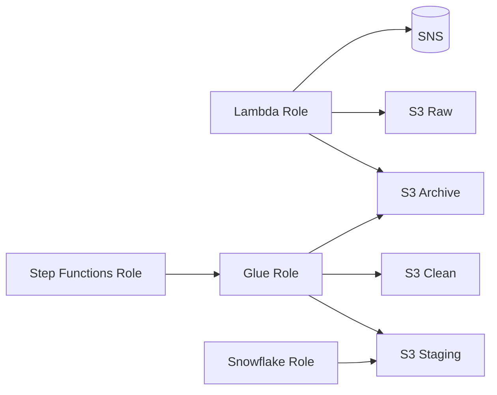

## Telco Customer 360 Pipeline

This document contains the **exact IAM policies attached to each role** in the Telco Customer 360 pipeline.

All ARNs use **placeholders** to avoid exposing sensitive information.  
Each policy is intentionally scoped to the **minimum permissions required**.

---

## 1️⃣ Lambda Ingestion Role

### Role Name
```
telcocustomer360pipeline_lambdafunction
```


### Responsibility
This role allows Lambda to act as a **gatekeeper** at ingestion time:
- validate incoming files
- move files to the correct S3 zone
- notify on failures

---

### IAM Policy - Lambda Ingestion

```json
{
  "Version": "2012-10-17",
  "Statement": [
    {
      "Sid": "S3RawArchiveRejectedAccess",
      "Effect": "Allow",
      "Action": [
        "s3:GetObject",
        "s3:PutObject",
        "s3:DeleteObject"
      ],
      "Resource": [
        "arn:aws:s3:::<BUCKET_NAME>/raw/*",
        "arn:aws:s3:::<BUCKET_NAME>/archive/*",
        "arn:aws:s3:::<BUCKET_NAME>/rejected/*"
      ]
    },
    {
      "Sid": "PublishIngestionAlerts",
      "Effect": "Allow",
      "Action": "sns:Publish",
      "Resource": "arn:aws:sns:<REGION>:<ACCOUNT_ID>:<SNS_TOPIC_NAME>"
    },
    {
      "Sid": "CloudWatchLogging",
      "Effect": "Allow",
      "Action": [
        "logs:CreateLogGroup",
        "logs:CreateLogStream",
        "logs:PutLogEvents"
      ],
      "Resource": "*"
    }
  ]
}
```

### Explicitly NOT Allowed
- No access to `clean/` or `staging/`
- No Glue permissions
- No Step Functions permissions
- No Snowflake access

---

## 2️⃣ Glue ETL Role (Job A + Job B)

### Role Name
```
telcocustomer360pipeline_gluerole
```


### Responsibility
This role supports **data transformation only** and is shared by Glue Job A and Glue Job B.

---

### IAM Policy — Glue ETL

```json
{
  "Version": "2012-10-17",
  "Statement": [
    {
      "Sid": "S3ETLReadWrite",
      "Effect": "Allow",
      "Action": [
        "s3:GetObject",
        "s3:PutObject"
      ],
      "Resource": [
        "arn:aws:s3:::<BUCKET_NAME>/archive/*",
        "arn:aws:s3:::<BUCKET_NAME>/clean/*",
        "arn:aws:s3:::<BUCKET_NAME>/staging/*"
      ]
    },
    {
      "Sid": "GlueCatalogAccess",
      "Effect": "Allow",
      "Action": [
        "glue:GetDatabase",
        "glue:GetTable",
        "glue:GetTables",
        "glue:GetPartitions",
        "glue:CreateTable",
        "glue:UpdateTable"
      ],
      "Resource": "*"
    },
    {
      "Sid": "CloudWatchLogging",
      "Effect": "Allow",
      "Action": [
        "logs:CreateLogGroup",
        "logs:CreateLogStream",
        "logs:PutLogEvents"
      ],
      "Resource": "*"
    }
  ]
}
```

### Explicitly NOT Allowed
- No Step Functions execution
- No Snowflake access
- No access outside ETL S3 zones

---

## 3️⃣ Step Functions Execution Role

### Role Name
```
StepFunctions-telco-customer-state-machine-role-ombadcmyn
```


### Responsibility
Allows Step Functions to act as a **pure orchestrator**:
- start Glue jobs
- monitor Glue execution

This role does **not** touch data.

---

### IAM Policy - Step Functions

```json
{
  "Version": "2012-10-17",
  "Statement": [
    {
      "Sid": "GlueJobOrchestration",
      "Effect": "Allow",
      "Action": [
        "glue:StartJobRun",
        "glue:GetJob",
        "glue:GetJobRun",
        "glue:GetJobRuns"
      ],
      "Resource": "arn:aws:glue:<REGION>:<ACCOUNT_ID>:job/*"
    },
    {
      "Sid": "CloudWatchLogging",
      "Effect": "Allow",
      "Action": [
        "logs:CreateLogGroup",
        "logs:CreateLogStream",
        "logs:PutLogEvents"
      ],
      "Resource": "*"
    }
  ]
}
```

### Explicitly NOT Allowed
- No S3 access
- No data read/write
- No Snowflake access
---

## 4️⃣ Snowflake Storage Integration Role

### Role Name
```
Telco_pipeline_snowflake_role
```


### Responsibility
Allows Snowflake to securely read analytics-ready data from S3 via STS.

---

### IAM Policy - Snowflake Integration

```json
{
  "Version": "2012-10-17",
  "Statement": [
    {
      "Sid": "AllowSnowflakeReadStaging",
      "Effect": "Allow",
      "Action": "s3:GetObject",
      "Resource": "arn:aws:s3:::<BUCKET_NAME>/staging/*"
    },
    {
      "Sid": "AllowSnowflakeListBucket",
      "Effect": "Allow",
      "Action": "s3:ListBucket",
      "Resource": "arn:aws:s3:::<BUCKET_NAME>",
      "Condition": {
        "StringLike": {
          "s3:prefix": ["staging/*"]
        }
      }
    }
  ]
}
```

### Explicitly NOT Allowed
- No write or delete permissions
- No access to `raw/`, `archive/`, or `clean/`
- No access to any AWS service besides S3

---

## 5️⃣ IAM Permission Boundary - Visual Summary



---

## 6️⃣ Summary

The IAM policy design ensures that:
- every service operates within a tight boundary
- data quality is enforced by access control
- security decisions are auditable and intentional

This mirrors real enterprise data platforms where IAM is a **first-class architectural concern**.
