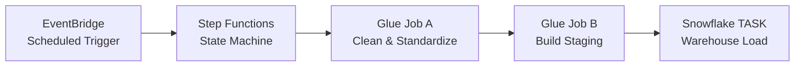
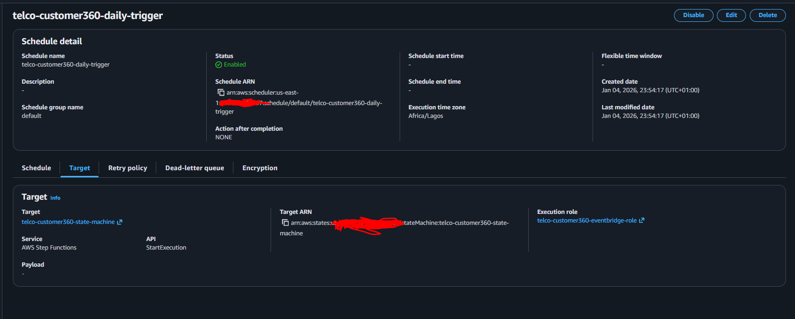
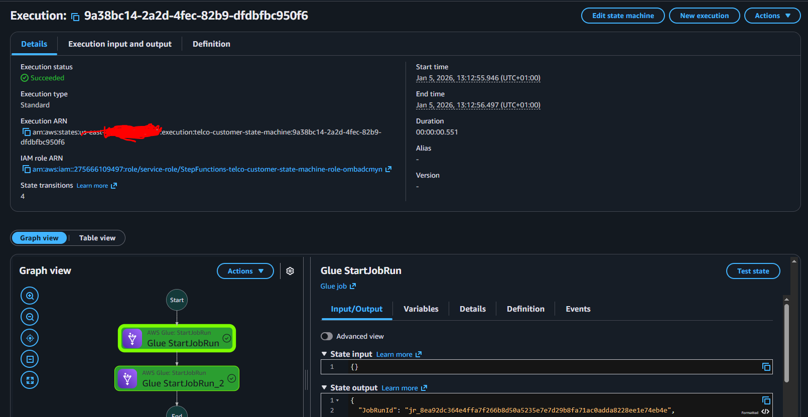
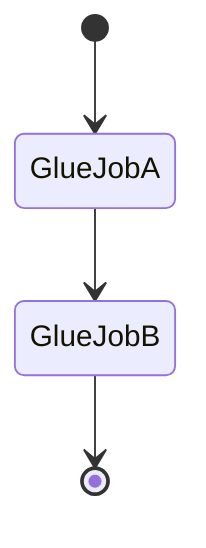

# Orchestration: EventBridge & Step Functions  
## Telco Customer 360 Pipeline

---

## 1. Purpose of This Document

This document explains **how the pipeline is orchestrated end-to-end**, specifically:
- how execution is scheduled
- how ETL steps are coordinated
- how failures are handled
- why orchestration is split between AWS and Snowflake

The intent is to clearly answer:
> *When does the pipeline run, and what guarantees correct execution order?*

---

## 2. Orchestration Philosophy

When designing orchestration, concerns are deliberately separated:

- **AWS handles ingestion and transformation**
- **Snowflake handles warehouse logic**

This avoids tight coupling, reduces operational complexity, and mirrors real enterprise environments.

---

## 3. High-Level Orchestration Flow



EventBridge decides **when** the pipeline runs.  
Step Functions decides **how** it runs.

---

## 4. EventBridge - Pipeline Scheduler



### Role of EventBridge
EventBridge is used purely as a **time-based scheduler**.

Intentionally avoided:
- file-triggered execution
- tightly coupled event chains

This ensures:
- predictable batch windows
- simpler recovery
- easier backfills

### Schedule Characteristics
- Runs on a fixed cadence (e.g. daily)
- Triggers Step Functions
- Contains no business logic
- Can be paused or adjusted without code changes

### Why Not File-Based Triggers?
- Files may arrive late or out of order
- Partial uploads can occur
- Upstream systems are not always reliable

Batch windows provide determinism, which is critical for analytics pipelines.

---

## 5. Step Functions - Workflow Orchestrator



### Role of Step Functions
Step Functions acts as the **control plane** for the ETL workflow.

It is responsible for:
- enforcing execution order
- stopping the pipeline on failure
- providing execution visibility
- ensuring no partial downstream processing occurs

Step Functions does **not** process data itself.

---

## 6. State Machine Design



### Execution Characteristics
- Glue jobs run synchronously
- Next step starts only after success
- Any failure halts the pipeline immediately

This guarantees data consistency across layers.

---

## 7. Glue Job Invocation Strategy

### Glue Job A - Clean & Standardize
- Reads validated source data
- Enforces schemas
- Writes standardized Parquet

### Glue Job B - Build Staging
- Deduplicates data
- Resolves latest entity state
- Produces analytics-ready snapshots

Both jobs are executed using:

```
glue:startJobRun.sync
```

This ensures Step Functions waits for completion before proceeding.

---

## 8. Failure Handling & Visibility

If any Glue job fails:
- Step Functions immediately stops execution
- Downstream steps are not triggered
- Failure is visible in execution history
- Logs are available in CloudWatch

This prevents:
- partial loads
- inconsistent data states
- silent failures

---

## 9. Snowflake Orchestration Boundary

Once Glue Job B completes:
- Data is fully prepared in `s3://.../staging/`
- AWS orchestration stops
- Snowflake takes over via a scheduled TASK

This separation ensures:
- Snowflake logic is owned by the warehouse
- AWS does not require Snowflake credentials
- Each platform operates independently

---

## 10. Why Not a Single Orchestrator?

All orchestration is intentionally **not** forced into one tool.

| Layer | Orchestrator |
|-----|-------------|
| Ingestion & ETL | AWS Step Functions |
| Warehouse Logic | Snowflake TASK |

This design:
- reduces cross-platform dependencies
- simplifies troubleshooting
- aligns with real-world data platform ownership models

---

## 11. Operational Control

The orchestration setup supports:
- pausing schedules safely
- manual re-runs of Glue jobs
- controlled backfills
- independent Snowflake reprocessing

No code changes are required for normal operational adjustments.
