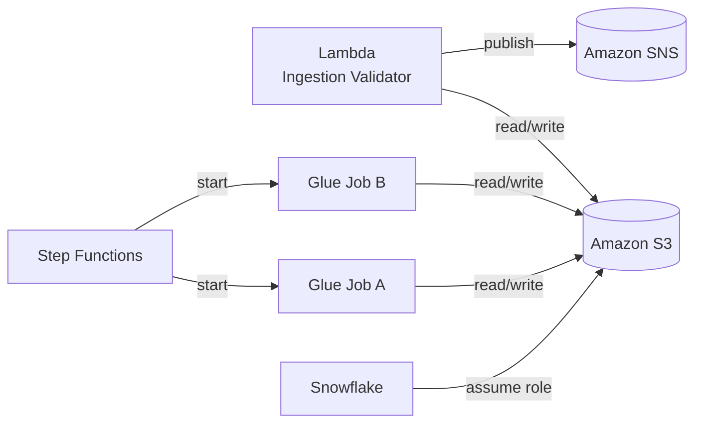
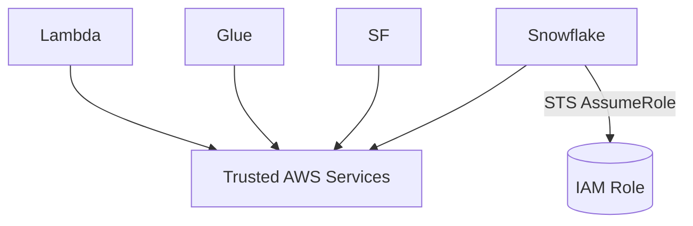

# IAM Roles & Security Model  
## Telco Customer 360 Pipeline (AWS)

---

## 1. Purpose of This Document

This document explains **how IAM roles are designed and used** across the Telco Customer 360 pipeline.

The IAM design goals are to:
- enforce **least privilege**
- clearly separate responsibilities
- avoid shared or overly powerful roles
- make security decisions easy to reason about during operations and audits

All permissions are intentional — nothing is accidental.

---

## 2. IAM Design Philosophy

The IAM model follows four core principles:

1. **One role per service**
2. **No role reuse**
3. **Explicit trust relationships**
4. **Minimal permissions required to function**

This ensures that a failure or compromise in one service does **not** propagate across the system.

---

## 3. High-Level IAM Architecture



Each arrow represents a deliberate permission boundary.

---

## 4. IAM Roles Overview

| Role Name | Used By | Primary Responsibility |
|---------|--------|------------------------|
| telco-lambda-ingestion-role | AWS Lambda | File validation & routing |
| telco-glue-etl-role | AWS Glue | Data processing |
| telco-step-functions-role | Step Functions | Pipeline orchestration |
| telco-snowflake-integration-role | Snowflake | Secure S3 access |

---

## 5. Lambda Ingestion Role

**Role**
```
telco-lambda-ingestion-role
```

### Why this role exists
This role protects the pipeline at the entry point.  
No file reaches ETL unless it passes validation here.

### Permissions granted

**Read from**
```
s3://.../raw/
```

**Write to**
```
s3://.../archive/
s3://.../rejected/
```

- Publish alerts to SNS  
- Write logs to CloudWatch  

### Permissions explicitly denied
- No access to `clean/` or `staging/`
- No Glue access
- No Step Functions access
- No Snowflake access

This ensures Lambda cannot mutate downstream data or bypass controls.

---

## 6. Glue ETL Role (Shared by Job A & Job B)

**Role**
```
telco-glue-etl-role
```

### Why a single Glue role
Glue Job A and Job B perform different tasks, but both:
- read from S3
- write to S3
- emit logs

Using one role avoids duplication while maintaining isolation from other services.

### Permissions granted

**Read from**
```
archive/
clean/
```

**Write to**
```
clean/
staging/
```

- Access Glue Data Catalog  
- Write logs to CloudWatch  

### Key restrictions
Glue **cannot**:
- publish to SNS
- trigger other Glue jobs
- interact with Snowflake directly

Glue only processes data — nothing else.

---

## 7. Step Functions Execution Role

**Role**
```
telco-step-functions-role
```

### Why this role exists
Step Functions does not process data.  
It only coordinates execution.

### Permissions granted
- Start Glue job runs
- Read Glue job metadata
- Read Glue job run status
- Emit execution logs

### Permissions denied
- No S3 access
- No data read/write
- No Snowflake access

This guarantees Step Functions cannot manipulate data even if misconfigured.

---

## 8. Snowflake Integration Role

**Role**
```
telco-snowflake-integration-role
```

### Purpose
This role enables Snowflake to securely read data from S3 without storing AWS credentials.

### How it works
- Snowflake assumes this role via STS
- The role grants **read-only** access to:
```
s3://.../staging/
```

Access is enforced by:
- IAM trust policy
- External ID
- S3 bucket policy

### Security benefits
- No long-lived secrets
- No write permissions
- No access to raw or clean layers

Snowflake only sees what analysts are allowed to see.

---

## 9. Trust Relationships



Each role:
- trusts only the service that needs it
- does not trust other AWS services by default

---

## 10. Why This IAM Model Works

This design ensures:
- reduced blast radius
- clear accountability
- easy auditing
- production-grade security

If a service fails or misbehaves, it cannot escape its responsibility boundary.
