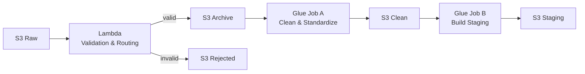

# Compute Layer: Lambda & Glue Jobs  
## Telco Customer 360 Pipeline

---

## 1. Purpose of This Document

This document explains **how compute is used in the pipeline**, specifically:
- what the Lambda function is responsible for
- what Glue Job A does
- what Glue Job B does
- how responsibility is deliberately separated between them

This layer is designed to ensure:
- bad data never reaches ETL
- ETL jobs remain simple and focused
- failures are isolated early
- reprocessing is always possible

---

## 2. High-Level Compute Flow



Each compute component has a single, clearly defined responsibility.

---

## 3. Lambda — Ingestion Validation & Routing

### Why Lambda Exists
Lambda protects the pipeline at the point of entry.  
Invalid data is stopped **before** it reaches ETL.

This reduces:
- Glue job failures
- wasted compute
- downstream debugging complexity

### Lambda Responsibilities
- Detect dataset type (customers, plans, activity)
- Validate file format (NDJSON or CSV)
- Reject corrupt or malformed files
- Route files to the correct S3 zone

### Lambda Outcomes

| Condition | Action |
|---------|--------|
| File is valid | Move to `archive/` |
| File is invalid | Move to `rejected/` and alert |

### Lambda Does NOT
- transform data
- deduplicate
- join datasets
- trigger Glue directly

### Why Lambda Is Kept Small
Lambda is intentionally:
- lightweight
- stateless
- validation-focused

This avoids long execution times, complex retries, and tight coupling with ETL.

---

## 4. Glue Job A — Clean & Standardize

### Purpose
Glue Job A ensures **structural correctness**, not analytics.

Downstream data:
- conforms to schema
- uses consistent data types
- is safe to process at scale

### Input & Output

**Input**
```
archive/
```

**Output**
```
clean/
```

### Responsibilities
- Parse heterogeneous formats (NDJSON, CSV)
- Enforce expected schemas
- Cast data types
- Normalize column names
- Separate valid and invalid records

This job produces standardized Parquet data.

### Explicitly Does NOT
- Deduplicate
- Join datasets
- Apply business logic
- Handle SCD logic

Keeping this job narrow improves debuggability, reuse, and performance predictability.

---

## 5. Glue Job B — Build Staging Snapshots

### Purpose
Glue Job B prepares data for warehouse ingestion.

It transforms clean data into analytics-ready snapshots.

### Input & Output

**Input**
```
clean/
```

**Output**
```
staging/
```

### Responsibilities
- Deduplicate records using business keys
- Resolve latest entity state
- Join customers with plans
- Prepare point-in-time activity datasets

This job defines the formal contract between AWS and Snowflake.

### Snapshot Design Choice
Glue Job B **overwrites staging data** on each run to ensure:
- idempotent loads
- predictable warehouse behavior
- simplified downstream logic

Historical tracking is handled inside Snowflake.

---

## 6. Why Lambda + Two Glue Jobs

Compute is intentionally split:

| Component | Responsibility |
|---------|----------------|
| Lambda | Gatekeeping & validation |
| Glue Job A | Structural correctness |
| Glue Job B | Analytics preparation |

This avoids:
- monolithic ETL jobs
- hidden coupling
- complex recovery paths

Each component can be tested, rerun, and debugged independently.

---

## 7. Failure Handling Strategy

| Failure Point | Outcome |
|-------------|---------|
| Lambda fails | File rejected, alert sent |
| Glue Job A fails | Pipeline stops |
| Glue Job B fails | Pipeline stops |

No partial downstream processing is allowed.

---

## 8. Operational Flexibility

This compute design supports:
- replaying archived files
- rerunning individual Glue jobs
- backfilling historical dates
- evolving schemas safely

All without changing orchestration logic.
